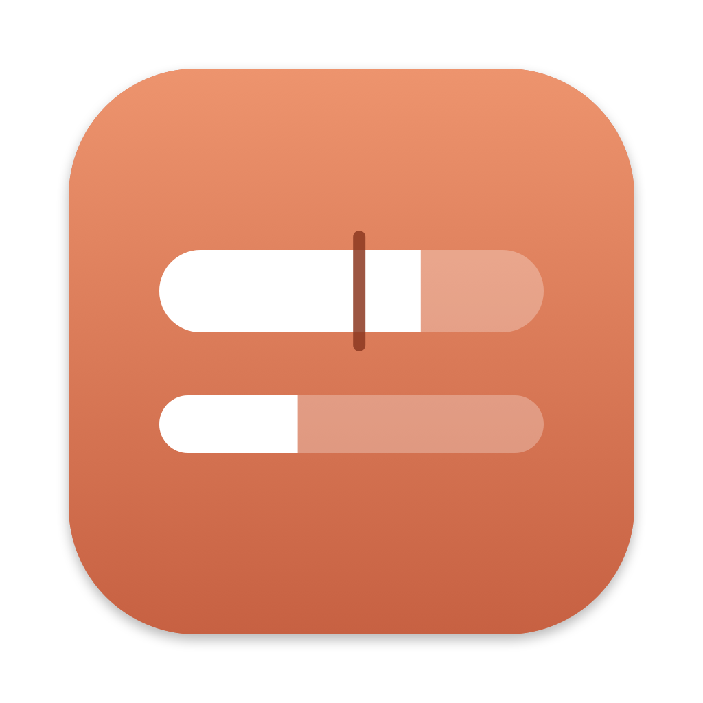
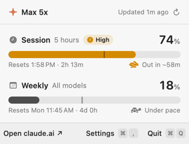
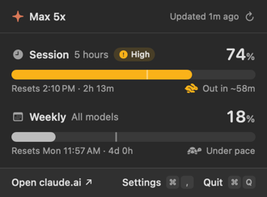

<p align="center">
  
</p>

<h1 align="center">Claude Usage Bar</h1>

A small native macOS menu bar app that shows how much of your Claude subscription limits you've used: the 5-hour session and the weekly limit, with a pace indicator that tells you whether you'll run out before the reset.


<p>
  
  
</p>

> **Unofficial.** Not affiliated with or endorsed by Anthropic. It reads an undocumented usage endpoint that Anthropic may change or remove at any time.

## Features

- **Menu bar:** 🕐 session % and 📅 weekly %, plus one pace animal for whichever is more urgent.
- **Pace:** compares how fast you're using a limit with how much of its window has passed.
  - 🐢 **Under pace:** at this rate you'll end below 75% of the limit.
  - 🐕 **On pace:** you'll end at 75–100%.
  - 🐇 **Ahead:** you'll run out before it resets (the popover shows roughly when).
  - 🐦 **Way ahead:** you're heading for more than 1.5× the limit.
- **Popover:** each limit with a progress bar, a tick showing how much of the window has elapsed, the reset time, and the pace. Bars turn amber from 70% and red from 90%.
- **Per-model limits (optional):** turn on "Per-model limits" in Settings to also see each model's own weekly limit (e.g. Fable) as a row in the popover. Only models your plan actually limits appear.
- **Settings:** what the menu bar shows, the pace animal, per-model limits, how often to check (default every 5 minutes), launch at login, and automatic updates.
- Closes when you click away. ⌘R refreshes, ⌘, opens settings, ⌘Q quits.

## Requirements

- macOS 14 or later (Apple silicon or Intel).
- [Claude Code](https://claude.com/claude-code) installed and signed in with a Claude Pro or Max account (`claude`, then log in). The app reuses that login; it has none of its own.

## Install

Run this in Terminal:

```sh
curl -fsSL https://raw.githubusercontent.com/miladbeigi/claude-usage-bar/main/install.sh | bash
```

It downloads the latest release, checks its SHA-256, installs **Claude Usage Bar.app** to `/Applications` (or `~/Applications` if that isn't writable), and launches it. Look for it in the menu bar. Read [`install.sh`](install.sh) first if you like; it's short. Running it again updates or reinstalls.

<details>
<summary>Manual install</summary>

1. Download `ClaudeUsageBar-<version>.zip` from the [latest release](../../releases/latest) and unzip it.
2. Move **Claude Usage Bar.app** to `/Applications`.
3. The app isn't notarized by Apple, so macOS blocks the first launch. Double-click the app, click **Done** (not Move to Trash), then open **System Settings → Privacy & Security**, scroll down and click **Open Anyway**. Or skip the warning by running:

   ```sh
   xattr -dr com.apple.quarantine "/Applications/Claude Usage Bar.app"
   ```

</details>

After that the app keeps itself up to date (see [Updates](#updates)).

## Build from source

Requires Xcode 16 or later (or a Swift 6 toolchain).

```sh
git clone <this repo>
cd claude-usage-bar
./build.sh --install   # builds "build/Claude Usage Bar.app", copies it to ~/Applications and launches it
```

Other options:

```sh
swift test             # run the unit tests
./build.sh             # build only
./build.sh --zip       # also write build/ClaudeUsageBar-<version>.zip and .sha256
```

### Build it with Claude

[`SPEC.md`](SPEC.md) describes the whole app: data source, pace formula, layout down to the point sizes, build script, CI and updater. You can have Claude Code rebuild it from scratch in an empty folder containing only that file:

```sh
claude "Build the macOS app described in SPEC.md. Follow it exactly, then run the tests and ./build.sh --install."
```

## How it works and privacy

- The app reads the OAuth token Claude Code saved in your Keychain (item `Claude Code-credentials`), through macOS's `security` tool, so there's no Keychain prompt. If Claude Code stores credentials in `~/.claude/.credentials.json` instead, it reads that.
- It sends the token only to `https://api.anthropic.com/api/oauth/usage`, the same endpoint that powers the usage numbers in Claude Code.
- It never refreshes or changes the token. If the token expires, run `claude` once.
- It doesn't read your conversations, transcripts or any local files besides the credentials, and it stores nothing except its settings.
- Update checks call the GitHub Releases API for this repository. You can turn them off in Settings.

## Updates

Every 6 hours (and on **Check now** in Settings) the app looks at this repository's latest GitHub release. If there's a newer version, an **Update to X.Y.Z** button appears in the header. Clicking it downloads the zip, checks its SHA-256 against the `.sha256` file published with the release, swaps the app in place and relaunches.

The checksum confirms the download isn't corrupted; it isn't a signature. Anyone who can publish releases to the repository can ship an update.

## Releasing

1. Bump `VERSION` (for example to `1.1.0`) and commit.
2. Tag and push: `git tag v1.1.0 && git push origin v1.1.0`.
3. The **Release** workflow runs the tests, builds a universal app, and publishes `ClaudeUsageBar-1.1.0.zip` and its `.sha256` to a GitHub release. Installed apps pick it up on their next check.

The **CI** workflow runs the tests and builds the app on every push to `main` and every pull request.

## Development

- Code is in `Sources/ClaudeUsageBar`, tests in `Tests/ClaudeUsageBarTests`.
- The app icon is generated by `swift scripts/make-icon.swift`, which writes `Resources/AppIcon.icns` and `docs/icon.png`.
- Debug builds can render screenshots with sample data, without network or Keychain access:

  ```sh
  swift build && .build/debug/ClaudeUsageBar --render docs
  ```

  This writes `light.png`, `dark.png` and `menubar.png`. Add `--settings` to render with Settings open. Native controls (menus and switches) show up as placeholders in these renders.

## License

[MIT](LICENSE)
